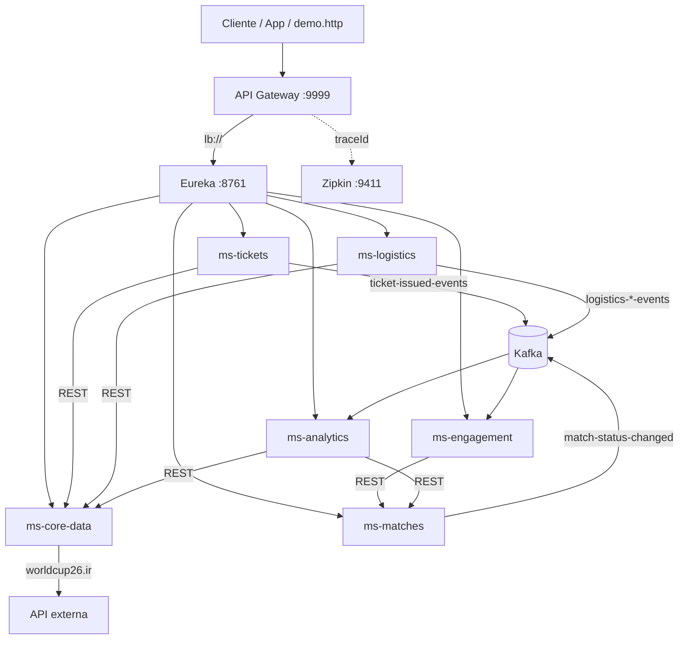

# ArenaCup OS

**Um ecossistema de microsserviços para operar a Copa do Mundo 2026 — do apito inicial ao craque da torcida, passando por ingressos, analytics e logística de delegações.**

Imagine milhões de torcedores, centenas de partidas, filas de bilheteria disputando o mesmo assento e, nos minutos finais, uma enxurrada de votos pelo jogador da partida. O **ArenaCup OS** nasce para absorver exatamente esse tipo de pressão: cada domínio de negócio vive no seu próprio serviço, com o banco certo para o job, comunicação síncrona quando a resposta precisa ser imediata e **Kafka** quando o mundo pode seguir em frente enquanto o evento viaja pela rede.

Este repositório (`WorldCupSpringProject`) é o **coração da operação**: API Gateway, Eureka, Docker Compose, init do PostgreSQL e o ponto de partida para subir toda a stack com um comando.

---

## A história em uma requisição

Um torcedor abre o app e compra um ingresso. Por trás do clique:

1. A requisição entra pelo **API Gateway** (`:9999`) — um único endereço para o mundo externo.
2. O Gateway consulta o **Eureka** e encaminha para `ms-tickets` via `lb://`.
3. O tickets valida jogo e estádio no **ms-core-data**, trava o assento no **Redis** e persiste no **PostgreSQL**.
4. Um evento `ticket-issued-events` dispara no **Kafka**; o **ms-analytics** consolida receita em tempo real.
5. Quando a partida termina, o **ms-matches** publica `match-status-changed-events`.
6. O **ms-engagement** abre a votação do Craque do Jogo no **Redis**; milhares de votos atualizam o ranking em O(log N).
7. Enquanto isso, o **ms-logistics** orquestra hotel, treino e transporte para delegações — com **Saga** e compensação automática.

Tudo rastreável no **Zipkin**. Tudo registrado no **Eureka**. Tudo sob o mesmo guarda-chuva.



---

## Os microsserviços — elenco principal

| Serviço | Missão | Stack de dados |
|---------|--------|----------------|
| **ms-core-data** | Fonte única de times, estádios, grupos e jogos (sync com worldcup26.ir) | PostgreSQL (`core_data`) |
| **ms-tickets** | Venda de ingressos com anti-double-booking | PostgreSQL + Redis + Kafka |
| **ms-matches** | Ciclo de vida da partida, timeline, candidatos ao craque | MongoDB + Kafka |
| **ms-engagement** | Votação "Craque do Jogo" em tempo real | Redis + Kafka |
| **ms-analytics** | Dashboards de receita e ocupação | PostgreSQL (`analytics`) + Kafka |
| **ms-logistics** | Delegações, hotéis, treinos, transporte — Saga orquestrada | PostgreSQL (`logistics`) + Kafka |

Infraestrutura compartilhada: **Eureka**, **Kafka**, **Redis**, **Zipkin**, **PostgreSQL**, **MongoDB**.

---

## Stack tecnológica

| Camada | Tecnologias |
|--------|-------------|
| **Runtime** | Java 21, Spring Boot 3.4+, Spring Cloud |
| **API** | Spring Web, Spring Cloud Gateway (MVC), REST |
| **Service Discovery** | Netflix Eureka |
| **Mensageria** | Apache Kafka (1 tópico por evento) |
| **Cache / ranking / locks** | Redis (Sorted Sets, Sets, SETNX) |
| **Persistência** | PostgreSQL, MongoDB, Flyway |
| **Resiliência** | Resilience4j (Retry + Circuit Breaker) |
| **Observabilidade** | Micrometer Tracing, Brave, Zipkin |
| **Containerização** | Docker, Docker Compose, multi-stage builds |

---

## Porta de entrada — API Gateway + Eureka

O cliente nunca precisa saber quantos serviços existem. Uma URL. Um Gateway. O Eureka resolve o resto.

Rotas definidas em `gateway/src/main/resources/application.yml`:

```yaml
spring:
  cloud:
    gateway:
      mvc:
        routes:
            - id: core-data
              uri: lb://ms-core-data
              predicates:
                - Path=/api/core/**
              filters:
                - StripPrefix=2
            - id: engagement
              uri: lb://ms-engagement
              predicates:
                - Path=/api/engagement/**
              filters:
                - StripPrefix=2
            - id: logistics
              uri: lb://ms-logistics
              predicates:
                - Path=/api/logistics/**
              filters:
                - StripPrefix=2
```

O prefixo `lb://` pede ao Eureka uma instância saudável do serviço. O **StripPrefix** traduz a URL pública (`/api/core/teams/MEX`) para o path interno (`/teams/MEX`) — o gateway fala a língua de cada microsserviço.

Tracing já configurado no gateway — cada requisição ganha `traceId` nos logs:

```yaml
management:
  zipkin:
    tracing:
      endpoint: ${ZIPKIN_ENDPOINT:http://localhost:9411/api/v2/spans}
logging:
  pattern:
    level: "%5p [${spring.application.name:},%X{traceId:-},%X{spanId:-}]"
```

---

## ms-core-data — a memória da Copa

Sincroniza dados mestres da API [worldcup26.ir](https://worldcup26.ir) para um cache local PostgreSQL. Resiliência na borda externa: **Retry** para falhas transitórias, **Circuit Breaker** quando a API fica fora, fallback para snapshot local.

```java
@Retry(name = "worldcup-api")
@CircuitBreaker(name = "worldcup-api", fallbackMethod = "fetchTeamsFallback")
public List<WorldCupApiResponses.WorldCupTeam> fetchTeams() {
    return get("/get/teams", WorldCupApiResponses.TeamsWrapper.class).teams();
}
```

Times, estádios, grupos e jogos alimentam todos os outros domínios — tickets valida partidas, logistics valida seleções, matches espelha jogos.

---

## ms-tickets — a corrida pelo assento

No pico de vendas, dezenas de usuários miram o mesmo lugar. O serviço combina **lock distribuído no Redis** com **unicidade no PostgreSQL**:

```java
String lockKey = "seat_lock:" + ticket.getMatchId() + ":" + ticket.getStadiumId() + ":" + ticket.getSeatCode();
Boolean lockAcquired = redisTemplate.opsForValue().setIfAbsent(lockKey, "LOCKED", Duration.ofSeconds(5));

if (Boolean.FALSE.equals(lockAcquired)) {
    throw new RuntimeException("Este assento já está em processo de compra por outro usuário neste exato momento!");
}

ticket.setStatus(TicketStatus.CONFIRMED);
Ticket savedTicket = ticketRepository.save(ticket);
eventPublisher.publishTicketIssued(event);
```

Compra confirmada → evento Kafka → analytics atualiza receita sem o tickets precisar conhecer o destino.

---

## ms-matches + ms-engagement — do apito final ao craque

Quando o árbitro encerra a partida (`FINISHED`), o matches publica no Kafka. O engagement **escuta** e abre a janela de votação — sem acoplamento HTTP entre os dois:

```java
@KafkaListener(topics = "${arenacup.kafka.topics.match-status-changed}", ...)
public void onMatchStatusChanged(@Payload MatchStatusChangedEvent event, ...) {
    if (openOn.equalsIgnoreCase(event.status())) {
        votingService.openWindow(event.matchId(), correlationId, candidates);
        return;
    }
    if (closeOn.equalsIgnoreCase(event.status())) {
        ClosedWindow closed = votingService.closeWindow(event.matchId(), correlationId);
        closed.winner().ifPresent(winner -> publisher.publish(new ManOfTheMatchChosenEvent(...)));
    }
}
```

Cada voto incrementa o ranking no Redis com operação atômica — **Sorted Set** para throughput e **Set** para voto único por usuário:

```java
Long added = redis.opsForSet().add(votersKey(matchId), userId);
if (added == null || added == 0L) {
    throw new DuplicateVoteException(matchId, userId);
}
redis.opsForValue().set(userVoteKey(matchId, userId), playerName);
Double score = redis.opsForZSet().incrementScore(rankingKey(matchId), playerName, 1.0);
```

---

## ms-logistics — a Saga das delegações

Reservar hotel, centro de treino e transporte num único fluxo. Se o transporte falhar, a Saga **compensa** — cancela treino e hotel na ordem reversa:

```java
@Transactional
public String startFullPackage(FullPackageRequest request) {
    String correlationId = UUID.randomUUID().toString();
    LogisticsSagaState sagaState = new LogisticsSagaState();
    sagaState.setCurrentStep(SagaStep.HOTEL_BOOKING);
    // Passo 1: hotel → Passo 2: treino → Passo 3: transporte
    sagaState.setCurrentStep(SagaStep.COMPLETED);
    eventPublisher.publishSagaCompleted(...);
}
```

Cada passo bem-sucedido publica evento Kafka; o estado da Saga fica persistido para auditoria e consulta via `GET /logistics/saga/{correlationId}`.

---

## Persistência poliglota — o banco certo para cada história

```sql
CREATE SCHEMA IF NOT EXISTS core_data;
CREATE SCHEMA IF NOT EXISTS tickets;
CREATE SCHEMA IF NOT EXISTS analytics;
CREATE SCHEMA IF NOT EXISTS logistics;
```

| Dado | Por quê |
|------|---------|
| **PostgreSQL** (core, tickets, analytics, logistics) | Transações ACID, integridade referencial |
| **MongoDB** (matches) | Timeline de eventos embutida no documento — schema flexível |
| **Redis** (tickets, engagement) | Locks distribuídos e ranking em tempo real |
| **Kafka** | Desacoplamento assíncrono entre domínios |

---

## Subir a stack

```powershell
cd code/WorldCupSpringProject
docker compose up --build
```

Primeira execução: aguarde os healthchecks (~2–3 min). Para recriar bancos do zero:

```powershell
docker compose down -v
docker compose up --build
```

Build local de todos os JARs (JDK 21):

```powershell
.\build-all.ps1
```

---

## URLs da operação

| Serviço | URL |
|---------|-----|
| **API Gateway** | http://localhost:9999 |
| **Eureka** (service registry) | http://localhost:8761 |
| **Zipkin** (tracing distribuído) | http://localhost:9411 |
| **Kafka UI** | http://localhost:8085 |
| **PostgreSQL** | `localhost:5433` — db `arenacup`, user/pass `arenacup` |

### Rotas públicas (via Gateway)

| Prefixo | Microsserviço |
|---------|---------------|
| `/api/core/**` | ms-core-data |
| `/api/matches/**` | ms-matches |
| `/api/tickets/**` | ms-tickets |
| `/api/engagement/**` | ms-engagement |
| `/api/analytics/**` | ms-analytics |
| `/api/logistics/**` | ms-logistics |

Exemplos:

```
GET  http://localhost:9999/api/core/teams/MEX
POST http://localhost:9999/api/tickets/buy
GET  http://localhost:9999/api/analytics/summary
POST http://localhost:9999/api/logistics/logistics/full-package
```

---

## Demo ponta a ponta

Arquivo `../arenacup-demo.http` — fluxo completo: ingresso → analytics → partida → votação.

Scripts de carga no `ms-engagement/scripts/` e `ms-tickets/scripts/` para simular concorrência real.

---

## Estrutura deste repositório

```
WorldCupSpringProject/
├── docker-compose.yml      # Stack completa ArenaCup
├── build-all.ps1           # Build de todos os microsserviços
├── eureka/                 # Service Discovery (:8761)
├── gateway/                # API Gateway (:9999)
└── postgres/init/          # Schemas e DDL inicial
    ├── 01-schemas.sql
    ├── 02-core-data-tables.sql
    ├── 03-tickets.sql
    ├── 06-analytics.sql
    └── 07-core-data-sync-metadata.sql
```

Microsserviços (repositórios irmãos):

```
../ms-core-data/
../ms-tickets/
../ms-matches/
../ms-engagement/
../ms-analytics/
../ms-logistics/
```

---

## Observabilidade

Tracing distribuído com **Micrometer + Brave → Zipkin**. Cada serviço exporta spans; no UI você vê o caminho completo — Gateway → tickets → core-data → Kafka → analytics — numa única trace.

Logs correlacionados com `%X{traceId:-}` em cada container.

---

## ArenaCup OS

Microsserviços especializados. Comunicação síncrona onde a resposta importa. Eventos onde o tempo é elastic. Bancos escolhidos pelo domínio. Resiliência na fronteira. Uma Copa inteira, uma arquitetura.

**Suba a stack. Abra o Zipkin. Dispare a demo. A Copa começa em `:9999`.**
