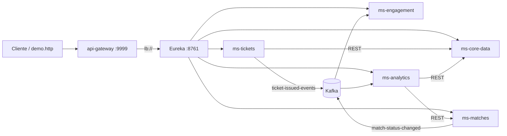

# ArenaCup OS — WorldCupSpringProject

Repositório central da stack ArenaCup: **Eureka**, **API Gateway**, **docker-compose**, init do Postgres e scripts de build.

## Escopo (6 repositórios)

| Pasta | Papel |
|-------|--------|
| `WorldCupSpringProject/` | Eureka, Gateway, compose, postgres/init |
| `../ms-core-data/` | Dados mestres (worldcup26.ir) |
| `../ms-tickets/` | Ingressos + Kafka producer |
| `../ms-matches/` | Partidas (MongoDB) |
| `../ms-engagement/` | Votação Craque do Jogo |
| `../ms-analytics/` | Analytics (`ticket-issued-events`) |

## Arquitetura



## Subir a stack

```powershell
cd code/WorldCupSpringProject
docker compose up --build
```

Primeira execução: ~2–3 min até todos os healthchecks ficarem verdes.

Para banco limpo (recria schemas init):

```powershell
docker compose down -v
docker compose up --build
```

## URLs

| Serviço | URL |
|---------|-----|
| API Gateway | http://localhost:9999 |
| Eureka | http://localhost:8761 |
| Kafka UI | http://localhost:8085 |
| PostgreSQL | localhost:5433 (`arenacup` / `arenacup` / `arenacup`) |

## Rotas do Gateway

| Prefixo | Destino Eureka |
|---------|----------------|
| `/api/core/**` | `lb://ms-core-data` |
| `/api/matches/**` | `lb://ms-matches` |
| `/api/tickets/**` | `lb://ms-tickets` |
| `/api/engagement/**` | `lb://ms-engagement` |
| `/api/analytics/**` | `lb://ms-analytics` |

StripPrefix=2 — ex.: `GET /api/core/teams/MEX` → `ms-core-data/teams/MEX`.

## Build local (opcional)

```powershell
.\build-all.ps1
```

Requer JDK 21. Os Dockerfiles fazem build multi-stage sem Maven local.

## Demo E2E

`../arenacup-demo.http` — ingresso → analytics → partida → votação.

## Estrutura

```
WorldCupSpringProject/
├── docker-compose.yml
├── build-all.ps1
├── eureka/
├── gateway/
└── postgres/init/
    ├── 01-schemas.sql
    ├── 02-core-data-tables.sql
    ├── 03-tickets.sql
    ├── 06-analytics.sql
    └── 07-core-data-sync-metadata.sql
```

## Seed core-data (manual)

Snapshots em `../ms-core-data/postgres/seed/` — não rodam no `docker up`. Ver README do ms-core-data.
